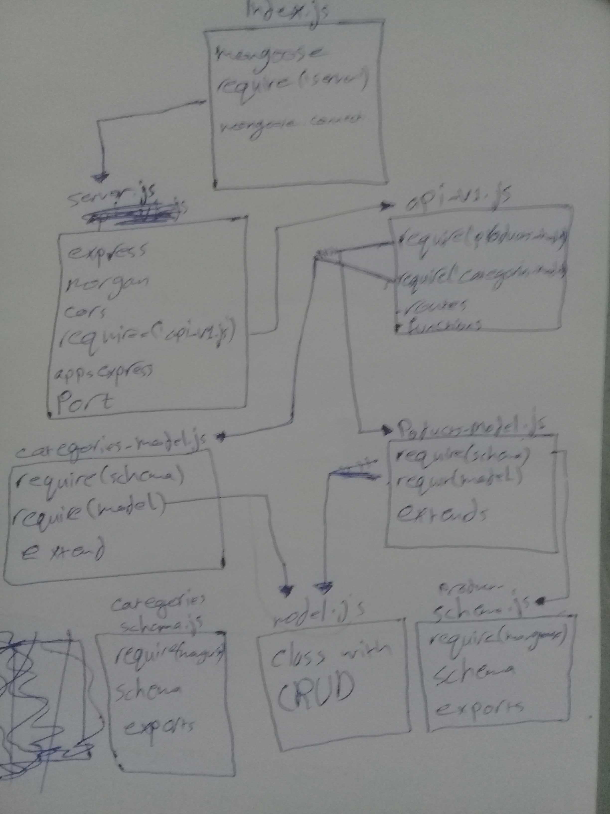

# api-server
## Lab-09

### Author : Hammad Ali

### Modules :
* logger.js
* server.js
* 500.js
* 404.js
* timestamp

#### How to run the app : 
* nodemon
*/api-vi/model

#### Test :
* we tests the api-v1 with server pages.

#### UML :

