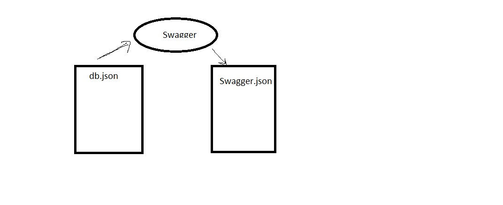

# api-server

## Project: json-server

### Author: Hammad Ali

### Links and Resources

### Setup

#### How to initialize/run your application 

**you should add this command to run your code after install the json-server module**
**json-server --watch ./data/db.json**

**I used POSTMAN to add and get the data** 

#### How to use your library 

**i used in this lab : npm i -g json-server**

#### Tests
**I used swagger.oi website to test my code**

#### Sweeger URL
**you will see in this link all the operations that i did**
[Swagger URL](https://app.swaggerhub.com/apis/Hammadsoloman/json-server/0.1)

### UML

